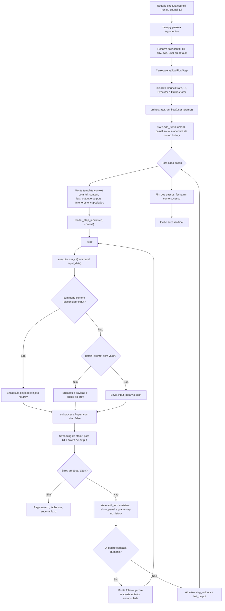

# Application Flow (Council)

Este documento descreve o fluxo ponta-a-ponta da execução do Council, desde o comando inicial até a finalização de um run.

## 1. Visão Geral

O fluxo cobre:

- bootstrap via CLI/TUI;
- resolução e validação de `flow.json`;
- orquestração passo a passo;
- montagem de prompt com blocos de dados delimitados;
- execução em subprocesso (`stdin` ou `argv`);
- streaming, histórico e encerramento.

## 2. Diagrama Mermaid

## 3. Caminhos de Input no Executor

`Executor._prepare_command()` decide entre dois canais:

1. `stdin`:
- usado quando o comando não contém `{input}` e não é o fallback `gemini -p` sem valor;
- `input_data` é enviado por `stdin`, seguido de `EOF`.

2. `argv`:
- usado quando o comando contém `{input}` ou no fallback de `gemini -p`/`--prompt` sem valor;
- o payload é delimitado com:
  - `===COUNCIL_INPUT_ARGV_START===`
  - `===COUNCIL_INPUT_ARGV_END===`

## 4. Delimitação de Dados Entre Agentes

No `Orchestrator`, os campos abaixo são encapsulados antes do `render_step_input()`:

- `{full_context}`
- `{last_output}`
- `{<key_de_passo_anterior>}`

Blocos usados:

- `===DADOS_DO_AGENTE_ANTERIOR===`
- `===FIM_DADOS_DO_AGENTE_ANTERIOR===`

Objetivo: reduzir prompt injection indireta entre etapas, separando instrução do passo de dados produzidos por agentes anteriores.

## 5. Arquivos-Chave

- `council/main.py`: entrada CLI/TUI e wiring principal.
- `council/config.py`: resolução/validação de `flow_config` e render de templates.
- `council/orchestrator.py`: laço de execução e controle do pipeline.
- `council/executor.py`: subprocessos, timeout, limites e streaming.
- `council/state.py`: histórico em memória e `full_context`.
- `council/history_store.py`: persistência de runs/steps.
